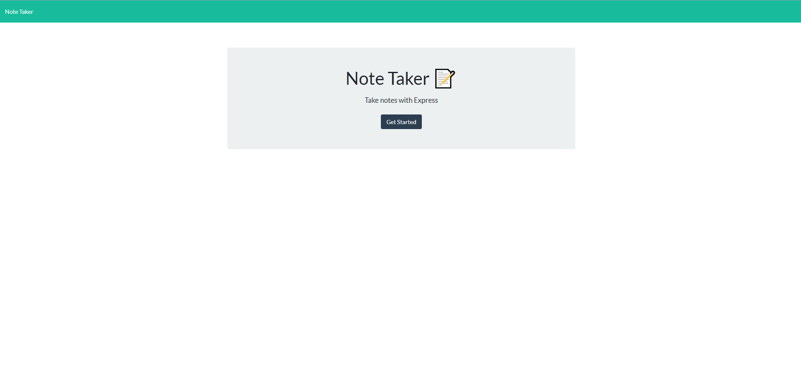

# Note Taker

## Table of Contents

* [Installation](#installation)
* [Summary](#summary)
* [Usage](#usage)
* [History](#history)
* [Credits](#credits)
* [License](#license)

# Installation

* Download my files in its entirety.
* Using your terminal, navigate to the folder on your desktop.
* Use command "npm start" in your terminal without the quotations.

or use this link: https://aqueous-waters-07043.herokuapp.com/

# Summary

This program allows the user to take notes with a title for each note and delete notes they've already written.

#### Main menu:

# Usage

* This is strictly for educational purposes.

# History

https://github.com/johnnylieu/Note_Taker/commits/master

# Credits

* gifmaker.org
* I want to thank my tutor Bobbi Tarkany for helping me with the finishing touches.

# License
 
* © 2019 Trilogy Education Services, a 2U, Inc. brand. All Rights Reserved.
* © UCSD Coding Bootcamp
